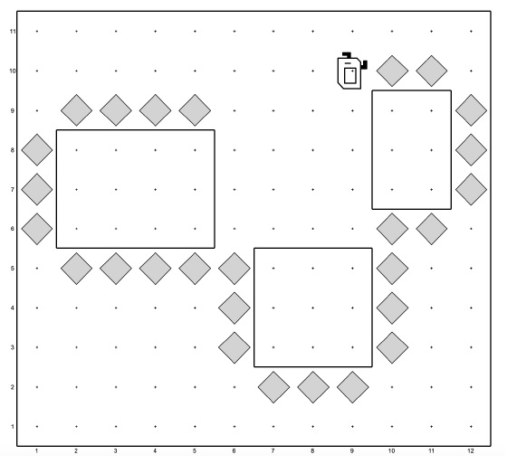
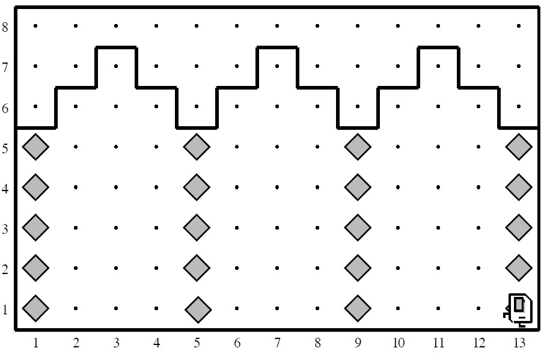
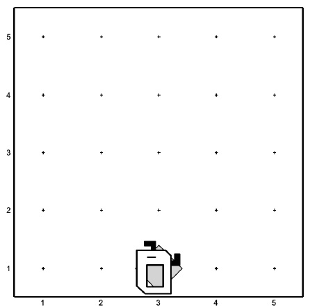
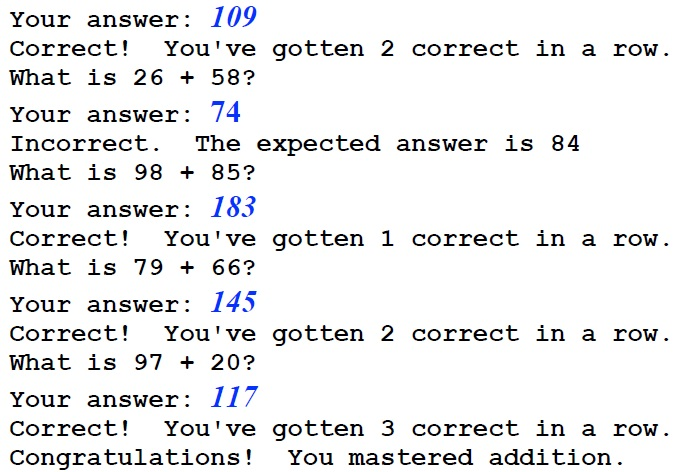
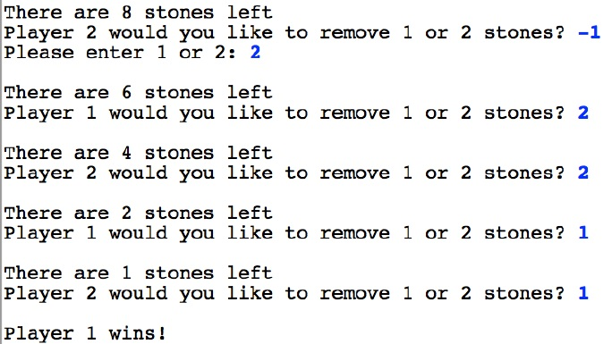
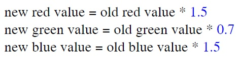
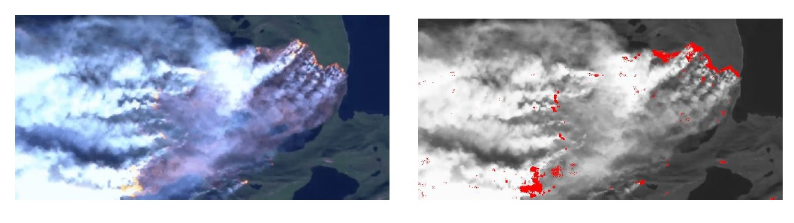
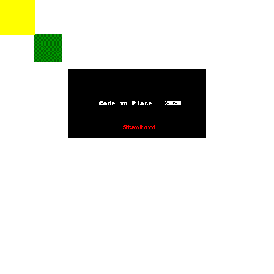

# Code in Place Stanford

**ASSIGNMENT 1**
**Problem 1 (TripleKarel.py)**

Your first task is to help Karel paint the exterior of some oddly-shaped buildings using beepers!
For this problem, Karel starts facing west next to a “building” (represented by a rectangle,
constructed from walls) whose sides span one or more corners. Karel’s goal is to paint all of the
buildings present in the world by placing beepers along three of the sides of each of the buildings.

**Problem 2 (StoneMasonKarel.py)**

Your second task is to repair the damage done to the Main Quad in the 1989 Loma Prieta
earthquake. In particular, Karel should repair a set of arches where some of the stones (represented
by beepers, of course) are missing from the columns supporting the arches, as illustrated in Figure
5 (below).
Your program should work on the world shown above, but it should be general enough to handle
any world that meets the basic conditions outlined at the end of this problem. There are several
example worlds in the starter folder, and your program should work correctly in all of them.
When Karel is done, the missing stones in the columns should be replaced by beepers.

**Challenge: Problem 3 (MidpointKarel.py)**

As an exercise in solving algorithmic problems, program Karel to place a single beeper at the
center of 1st row. For example, say Karel starts in the 5x5 world.
Karel should end with Karel standing on a beeper in the following position

Note that the final configuration of the world should have only a single beeper at the midpoint of
1st row. Along the way, Karel is allowed to place additional beepers wherever it wants to, but must
pick them all up again before it finishes. Similarly, if Karel paints/colors any of the corners in the
world, they must all be uncolored before Karel finishes.
In solving this problem, you may count on the following facts about the world:

- Karel starts at 1st row and 1st column, facing east, with an infinite number of beepers in
its bag.
- The initial state of the world includes no interior walls or beepers.
- The world need not be square, but you may assume that it is at least as tall as it is wide.

Your program, moreover, can assume the following simplifications:

- If the width of the world is odd, Karel must put the beeper in the center square. If the width
is even, Karel may drop the beeper on either of the two center squares.
- It does not matter which direction Karel is facing at the end of the run.

You should make sure your program runs successfully in all of the following worlds (which are
just a few different examples to test out the generality of your solution): MidpointKarel.w (default world), Midpoint1.w, Midpoint2.w, Midpoint8.w

**ASSIGNMENT 2**
**Part 1: Sandcastles**

“Sandcastle” problems are meant to be fairly straightforward and make sure you’re solid
on particular concepts (like control flow, variables, and functions) before moving on to
writing larger programs. They’re kind of like building sandcastles in a sandbox – they’re
meant to be fun to do and no one gets hurt. 

1- Write a program in the file subtract_numbers.py that reads two real numbers from
the user and prints the first number minus the second number. You can assume the
user will always enter valid real numbers as input (negative values are fine). 

2 - Write a program in the file random_numbers.py that prints 10 random integers (each
random integer should have a value between 0 and 100, inclusive). Your program
should use a constant named NUM_RANDOM, which determines the number of random
numbers to print (with a value of 10). It should also use constants named MIN_RANDOM
and MAX_RANDOM to determine the minimal and maximal values of the random numbers
generated (with respective values 0 and 100). To generate random numbers, you should
use the function random.randint() from Python’s random library.

3 - Write a program in the file liftoff.py that prints out the calls for a spaceship that is
about to launch. Countdown the numbers from 10 to 1 and then write “Liftoff!” Your
program should include a for loop using range.

**Part 2: Khan-Sole Academy**

In this problem, you’ll write a program in the file khansole_academy.py that randomly
generates simple addition problems for the user, reads in the answer from the user, and then
checks to see if they got it right or wrong, until the user appears to have mastered the
material. More specifically, your program should be able to generate simple addition problems that
involve adding two 2-digit integers (i.e., the numbers 10 through 99). The user should be
asked for an answer to each problem. Your program should determine if the answer was
correct or not, and give the user an appropriate message to let them know. Your program
should keep giving the user problems until the user has gotten 3 problems correct in a row.

**Part 3: Ancient Game of Nimm**

Nimm is an ancient game of strategy that is named after the old German word for "take."
It is also called Tiouk Tiouk in West Africa and Tsynshidzi in China. Players alternate
taking stones until there are zero left. The game of Nimm goes as follows:
1. The game starts with a pile of 20 stones between the players
2. The two players alternate turns
3. On a given turn, a player may take either 1 or 2 stone from the center pile
4. The two players continue until the center pile has run out of stones.
5. The last player to take a stone loses.

**ASSIGNMENT 3**

**1.Code in Place Filter**

Write a program that asks the user to enter an image file name. It then loads that file and
applies the “Code in Place” filter. To apply the Code in Place filter, you are going to
change every pixel to have the following new red green and blue values:

**2.Finding forest flames**

Write a function called find_flames (in the file forestfire.py) that
highlights the areas where a forest fire is active. You’re given a satellite image of
Greenland’s 2017 fires (photo credit: Stef Lhermitte, Delft University of Technology).
Your job is to detect all of the “sufficiently red” pixels in the image, which are indicative
of where fires are burning in the image. We consider a pixel “sufficiently red” if its red 
value is greater than or equal to the average of the pixel’s three RGB values.
When you detect a “sufficiently red” pixel in the original image, you set its red value to
255 and its green and blue values to 0. This will highlight the pixel by making it entirely
red. For all other pixels (i.e., those that are not “sufficiently red”), you should convert
them to their grayscale equivalent, so that we can more easily see where the fire is
originating from. You can grayscale a pixel by summing together its red, green, and blue
values and dividing by three (finding the average), and then setting the pixel’s red, green,
and blue values to all have this same “average” value.
Once you highlight the areas that are on fire in the image (and greyscale all the remaining
pixels), you should see an image like that shown on the right in the image bellow.

**FINAL PROJECT**

The final project of Code in Place is meant to be a celebration of what you have learned
and a chance to explore one of the joys of coding. For the final project you can also
design a program to do whatever you like.

**My final Project:**

Generate a Python GIF of geometric figures using Pillow library.

It was amazing to be part of this course!

